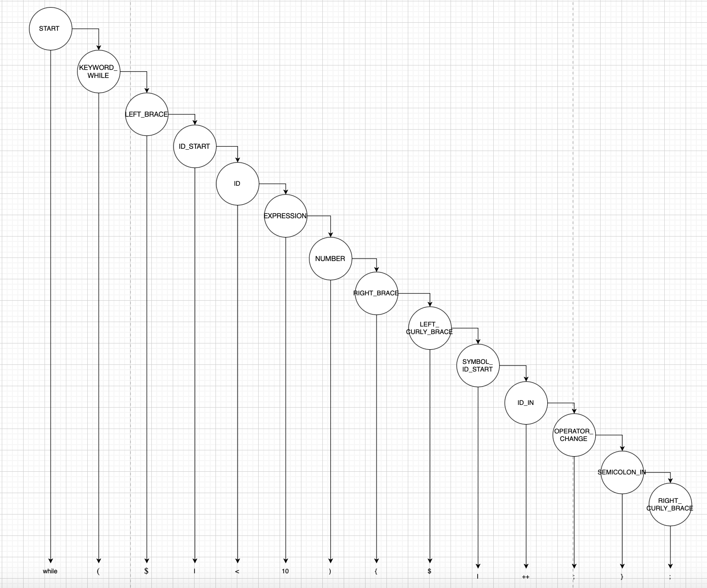

## Лабораторная работа 5. Построение AST и проверка контекстно-зависимых условий

# Цель работы.
Изучить назначение и принципы работы семантического анализатора в структуре компилятора. Освоить методы построения абстрактного синтаксического дерева (AST) и проверки контекстно-зависимых условий (семантических правил) для заданной синтаксической конструкции.

# Сведения об авторе.
Лабораторную работу сделала студентка группы АВТ-313 Федулова В.В.

# Вариант задания.
```
103. Цикл while на языке PHP
     
while ($i < 10) {
    $i++;
};
```

```
while ($counter < 5) {
    $counter++;
    $counter++;
};
```

# Контекстно-зависимые условия
Правило 4 (использование идентификаторов): Проверить, что используемые идентификаторы были объявлены ранее (для выражений).
Хотя бы одна переменная объявленная в условии должна быть в теле цикла. Все переменные из тела цикла должны быть в условии. 

Пример неправильного цикла
```
while ($i < 10) {
    $y++;
};
```
В данном случае две ошибки: переменная из условия не встречается в теле; переменная в теле не встречается в условии цикла.

# Структура AST
# Описание типов узлов (ConstDeclNode, FunctionDeclNode, IfNode, WhileNode и т.д.).

ASTNode: Базовый абстрактный класс, определяющий интерфейс для визуализации дерева и получения списка дочерних элементов

VarNode: Представляет собой обращение к переменной или её объявление через идентификатор

NumberNode: Хранит конкретное числовое значение, являющееся листом дерева

BinOpNode: Содержит бинарную операцию и связывает два операнда: левый и правый

UnaryOpNode: Представляет операцию над одним операндом, такую как декремент или инкремент

WhileNode: Управляет циклом с предусловием, связывая логическое выражение с телом цикла

BlockNode: Группирует последовательность инструкций в единый логический узел

# Рисунок CST / AST для верной строки в любом графическом редакторе (например, draw.io).

# Формат вывода AST в программе. 

# Тестовые примеры

# Инструкция по запуску
