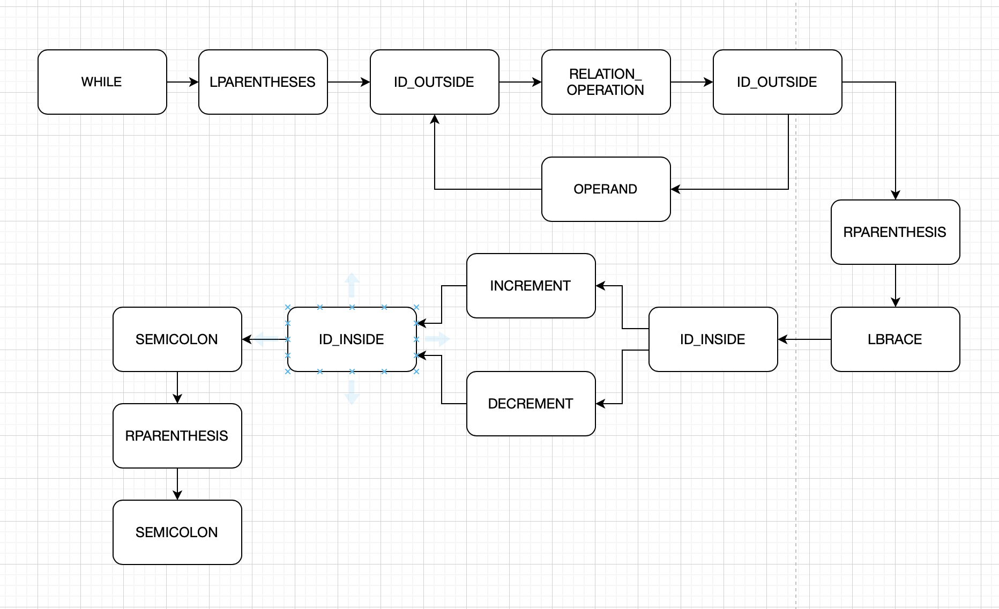
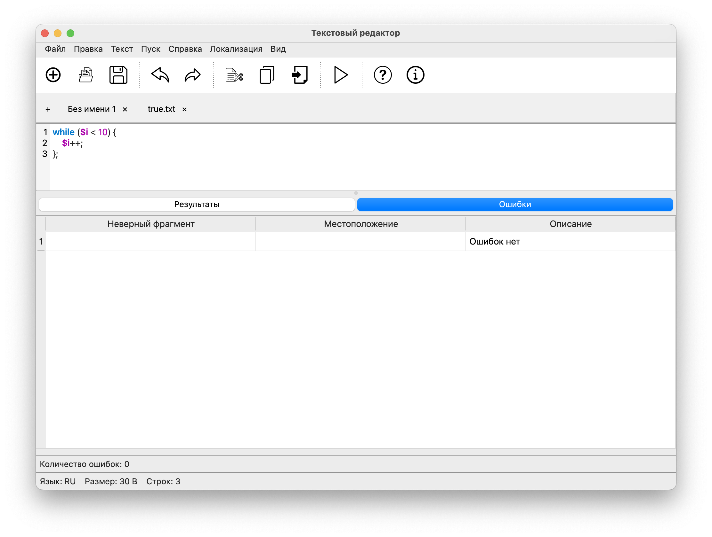
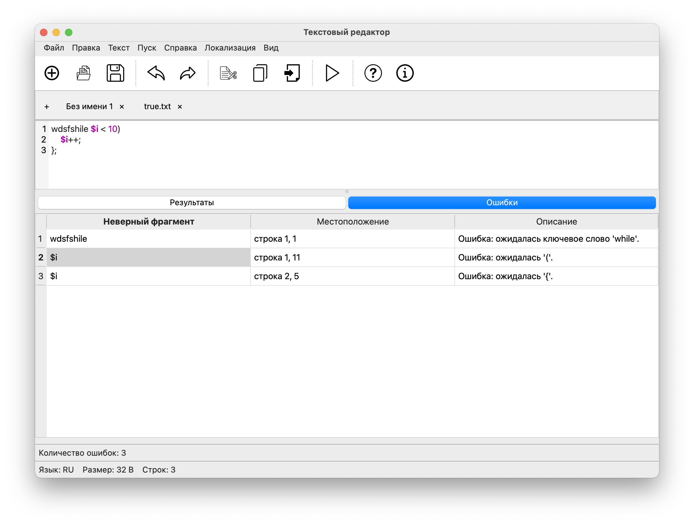
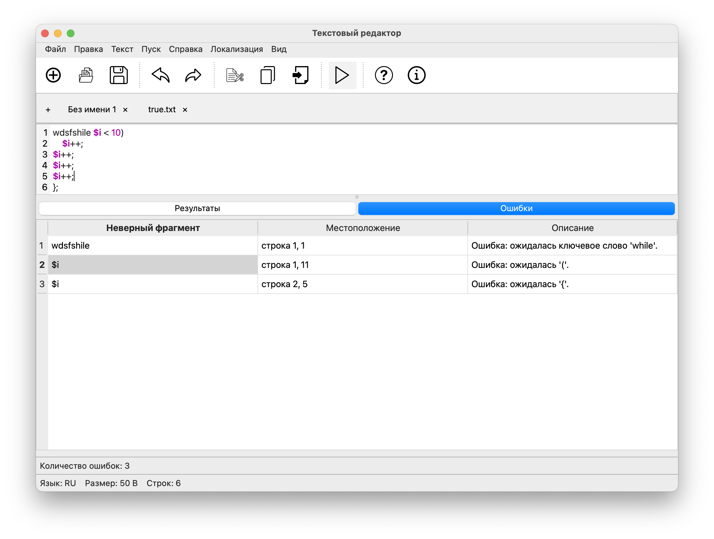

## Лабораторная работа 3. Разработка синтаксического анализатора (парсера)

# Цель работы.
Изучить назначение и принципы работы синтаксического анализатора в структуре компилятора. Спроектировать грамматику, построить соответствующую схему метода анализа грамматики и выполнить программную реализацию парсера с нейтрализацией синтаксических ошибок методом Айронса. Интегрировать разработанный модуль в ранее созданный графический интерфейс языкового процессора.

# Сведения об авторе.
Лабораторную работу сделала студентка группы АВТ-313 Федулова В.В.

# Вариант задания.
```
103. Цикл while на языке PHP
     
while ($i < 10) {
    $i++;
};
```

```
while ($counter < 5) {
    $counter++;
    $counter++;
};
```

# Разработка грамматики (полное определение разработанной грамматики).


```
1) <START> -> 'while' <KEYWORD_WHILE>
2) <KEYWORD_WHILE> -> '(' <LEFT_BRACE>
3) <LEFT_BRACE> -> '$' <ID_START>
4) <ID_START> -> letter <ID>
5) <ID> -> letter <ID> | digit <ID> | '_' <ID> | '<' <EXPRESSION> | '>' <EXPRESSION> | '==' <EXPRESSION> | '>=' <EXPRESSION> | '<=' <EXPRESSION> | '!=' <EXPRESSION>
6)<EXPRESSION> -> digit <NUMBER> 
7)<NUMBER> -> digit <NUMBER> | '||' <LEFT_BRACE> | '&&' <LEFT_BRACE> | ')' <RIGHT_BRACE>
8)<RIGHT_BRACE> -> '{' <LEFT_CURLY_BRACE>
9)<LEFT_CURLY_BRACE> -> ' '$' <SYMBOL_ID_START>
10)<SYMBOL_ID_START> -> letter <ID_IN>
11)<ID_IN> -> letter <ID_IN> | digit <ID_IN> | '_' <ID_IN> | '++' <OPERATOR_CHANGE> | '--' <OPERATOR_CHANGE>
12) <OPERATOR_CHANGE> -> ';' <SEMICOLON_IN>
13) <SEMICOLON_IN> -> '}' <RIGHT_CURLY_BRACE> | '$' <SYMBOL_ID_START>
14) <RIGHT_CURLY_BRACE> -> ';'  
```
letter - любой символ латинского алфавита (A-Z a-z)
digit -  любая цифра от 0 до 9
Vn:
<START>, <KEYWORD_WHILE>, <LEFT_BRACE>, <ID_START>, <ID>, <EXPRESSION>, <NUMBER>, <RIGHT_BRACE>, <LEFT_CURLY_BRACE>, <SYMBOL_ID_START>, <ID_IN>, <OPERATOR_CHANGE>, <SEMICOLON_IN>, <RIGHT_CURLY_BRACE>
Vt:
'while', '(', '$', letter, digit, '_', '<', '>', '==', '>=', '<=', '!=', '||', '&&', ')', '{', '}', '++', '--', ';', ''}', ';' 
Z = < START >

Грамматика дополнительного задания
```
grammar WhileLoop;

program
    : (whileStatement)* EOF
    ;

whileStatement
    : 'while' '(' condition ')' '{' body '}' ';'
    ;

condition
    : comparison (logicalOp comparison)*
    ;

comparison
    : ID comparisonOp NUMBER
    ;

logicalOp
    : '||' | '&&'
    ;

comparisonOp
    : '<' | '>' | '==' | '>=' | '<=' | '!='
    ;

body
    : (instruction)*
    ;

instruction
    : ID ('++' | '--') ';'
    ;


ID     : '$' [a-zA-Z_] [a-zA-Z0-9_]* ;
NUMBER : [0-9]+ ;
WS     : [ \t\r\n]+ -> skip ;

UNKNOWN : . ;
```

# Классификация грамматики
Данная грамматика контекстно-свободная, поскольку каждое правило имеет вид A → α где A принаджежит Vn, α принадлежит V*.

# Метод анализа
Метод анализа - рекурсивный спуск, где: 
- каждому нетерминалу грамматики ставится в соответствие отдельная программная единица (процедура или функция), которая распознаёт цепочку, порождаемую этим нетерминалом
- эти процедуры вызывают друг друга в соответствии с правилами грамматики, а в некоторых случаях — вызывают сами себя рекурсивно
- язык реализации такого метода обязательно должен поддерживать рекурсию



# Диагностика и нейтрализация синтаксических ошибок
Для диагностики и нейтрализации синтаксических ошибок взят метод Айронса. Метод Айронса — это способ синтаксического анализа, при котором возврат не используется. Вместо этого при обнаружении тупиковой ситуации (когда продолжение разбора по грамматике невозможно) анализатор отбрасывает литеры (символы), которые привели к ошибке, и продолжает разбор дальше.

# Тестовые примеры
Пример работы программы с правильными данными (без ошибок)




Пример работы программы с 3 ошибками 



Пример работы программы с 3 ошибками и большим кол-вом строк в теле цикла


